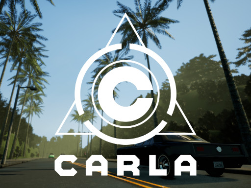
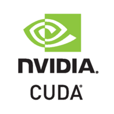
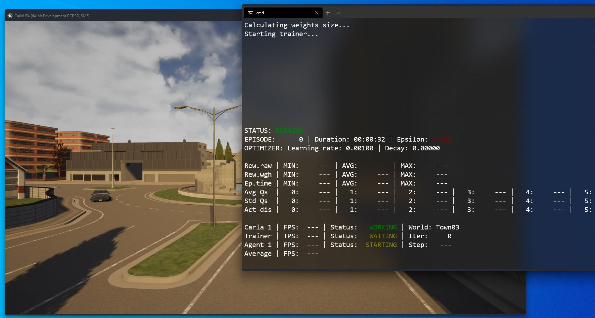
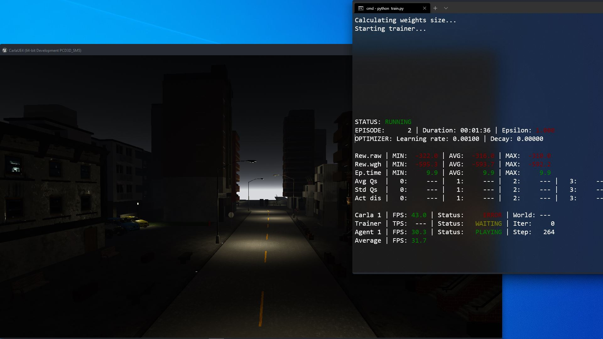

# navigate.AI
navigate.AI is a travel assistance system that uses artificial intelligence (AI), this project is developed in the programming language "Python" and has the objective of using "Deep Reinforcement Learning" to safely guide a car.

|  |  |  |
| ------------ | ------------ | ------------ |
|  |  |  |

# How to use the script
##Requirements
I recomend you using [Python3.7.5](https://www.python.org/downloads/release/python-375/ "Python3.7.5") and [CARLA0.9.8](https://github.com/carla-simulator/carla/releases/tag/0.9.8 "CARLA0.9.8").
If you want to train model using your **GPU** you need to install [CUDA v.10.0](https://developer.nvidia.com/cuda-10.0-download-archive "CUDA v.10.0") and [CuDNN](https://developer.nvidia.com/rdp/cudnn-archive "CuDNN") for that version of CUDA.
Install **requirements.txt** if you want to use the **CPU** for training your model
- `python -m pip install -r requirements.txt`

Install **requirements-gpu.txt** if you want to use the **GPU** for training your model
- `python -m pip install -r requirements-gpu.txt`
## To train your model
Edit settings.py, change the `CARLA_PATH` and adjust the settings to your taste.

Train running train.py.
- `python train.py`

##To play your trained model
Play running play.py.
- `python play.py`

